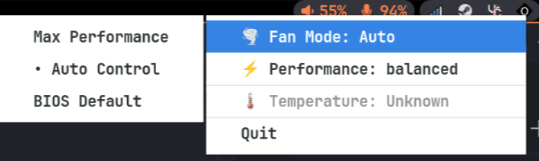

# Omenix


Fan control application for HP Omen laptops with system tray integration.



## Features

- **Fan Control**: Auto, Max Performance, or BIOS Default modes
- **Performance Modes**: Balanced and Performance profiles
- **System Tray**: Easy access via system tray icon
- **Temperature Monitoring**: Real-time CPU temperature display
- **Daemon Architecture**: Background service with GUI frontend

## Quick Start

### NixOS Users

Add to your system configuration:

```nix
{
  inputs.omenix.url = "github:noahpro99/omenix";

  # In your system configuration:
  services.omenix.enable = true;
}
```

Run the GUI:

```bash
omenix
```

if you have a desktop environment like hyprland,

```
exec-once = omenix
```

### Non-NixOS with Nix Package Manager

Install and run:

```bash
# Run directly
nix run github:noahpro99/omenix

# Or install to profile
nix profile install github:noahpro99/omenix
omenix
```
